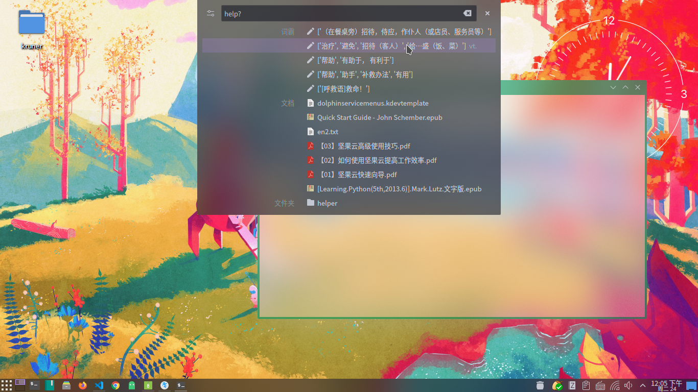

### Krunner dbus python plugin

krunner词典插件，释义来源于爱词霸(需要联网)，非常潦草，有时间了重写

使用方法： {单词}？
 
 
 执行，配置和开机启动

`make install-config` 

`make create-autostart`

On Debian/Ubuntu you need:   
`sudo apt install python3 python3-hglib`